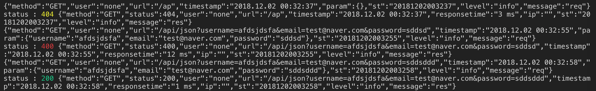

# express-skeleton

## Basic Feature
- Use PostgreSQL in Express: [pg](https://github.com/brianc/node-postgres)
- Log Service: [winston](https://github.com/winstonjs/winston)
- Params Validation: [Joi](https://github.com/hapijs/joi)
- Template Engine: [ejs](https://github.com/mde/ejs)
- Mailer Service: [nodemailer](https://nodemailer.com)
- Authenticate User: [jsonwebtoken](https://github.com/auth0/node-jsonwebtoken)


## Getting Started

```zsh
$ mkdir your-project-name
$ git clone https://github.com/LuceteYang/express-skeleton.git your-project-name
$ cd your-project-name
$ rm -rf .git && git init
$ cp .env.copy .env
$ mv README.md README_TEMP.md && echo "# your-project-name" >> REAMDE.md
```

```zsh
$ npm install
$ npm start
```

## Init
`Mailer` send when server start
```

// mailer send when server start
if (process.env.NODE_ENV === "production") {
  require("./lib/mailer")
    .serverStart()
    .catch(err => {
      logger.error("sendmailer serverStart error ", err);
    });
}
```
## Logger

- request log

method user url timestamp param timestamp st message


- response log

method status user url timestamp responsetime ip param st level message




## Test

- mailer test
```zsh
$ npm run prd
```
then mailer will send to your mail

- db test
```zsh
$ npm install
$ npm start
```
>check  
>http://localhost:4000/  
>http://localhost:4000/string  
>http://localhost:4000/json?username=yang&email=abc@def.com&password=111111  
>http://localhost:4000/db-connect  
=> [{"name":"yang"}] then db connect


- logger test

```zsh
$ npm run prd
```
then log file will be created in logs folder.

